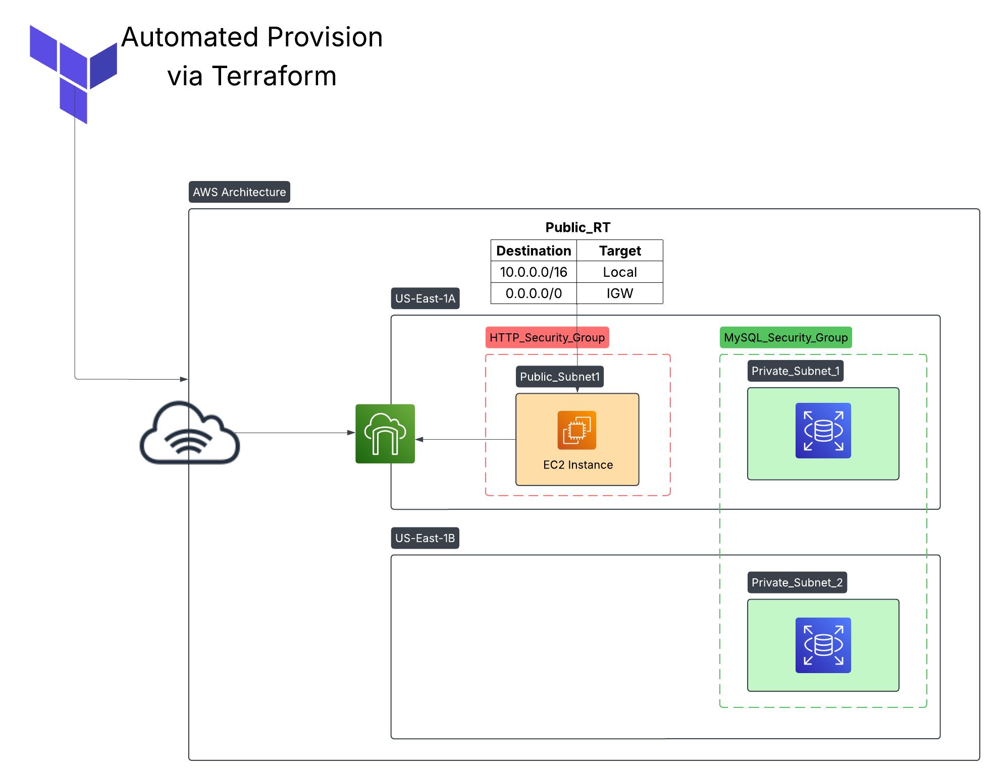

# AWS Architecture Using Terraform

This project sets up a basic AWS cloud environment using Terraform. It includes a VPC, public and private subnets, an EC2 instance, an RDS database, an Internet Gateway, and route tables.



## 🏗️ Overview

The architecture contains:

- A VPC (`10.0.0.0/16`)
- A Public Subnet (`10.0.1.0/24`) hosting an EC2 instance
- Two Private Subnets (`10.0.10.0/24` and `10.0.11.0/24`) hosting an RDS database
- An Internet Gateway for public access
- A Route Table for internal and external routing
- Security Groups for controlling EC2 and RDS traffic

---

## 📦 Terraform Modules Used

- **VPC Module (`./modules/vpc`)**
  - Creates the VPC, subnets, internet gateway, and routing tables.

- **EC2 Module (`./modules/ec2`)**
  - Launches an EC2 instance inside the public subnet.

- **RDS Module (`./modules/rds`)**
  - Deploys an RDS instance inside private subnets.

---

## 🔥 Resource Breakdown

### VPC
- **CIDR Block:** `10.0.0.0/16`
- **Subnets:**
  - Public Subnet (AZ: `us-east-1a`) - `10.0.1.0/24`
  - Private Subnet 1 (AZ: `us-east-1a`) - `10.0.10.0/24`
  - Private Subnet 2 (AZ: `us-east-1b`) - `10.0.11.0/24`

### EC2 Instance
- Deployed in Public Subnet
- Security Group:
  - Allow SSH (Port 22)
  - Allow HTTP (Port 80)
- Public IP enabled

### RDS Instance
- Deployed in Private Subnets
- Security Group:
  - Allow MySQL (Port 3306) traffic **only** from EC2 instance

### Internet Gateway
- Attached to VPC
- Route Table forwards `0.0.0.0/0` traffic to the IGW

---

## 🔒 Security Groups

- **HTTP_Security_Group**
  - Inbound: SSH (22), HTTP (80) from anywhere
  - Outbound: All traffic

- **MySQL_Security_Group**
  - Inbound: MySQL (3306) only from EC2's Security Group

---

## 🔑 Key Pair Management

- A new **RSA 4096-bit** SSH Key is generated via Terraform.
- Private Key is saved locally as `my-key.pem`.
- Public Key is uploaded to AWS as a Key Pair.

---

## 🚀 How to Deploy

1. **Initialize Terraform**
   ```bash
   terraform init
   ```

2. **Review the Execution Plan**
    ```bash
   terraform plan
   ```

3. **Apply the Plan**
    ```bash
   terraform apply -auto-approve
   ```

4. **Access your EC2 Instance**
    ```bash
    ssh -i my-key.pem ec2-user@<Public-IP-of-EC2>
    ```